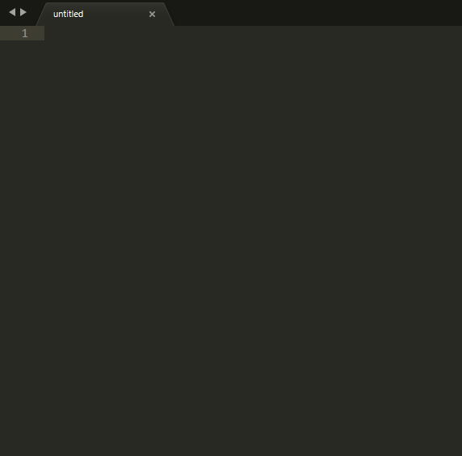

# Sublime 3 Dlang Auto-Module-Name

Sublime 3 D AutoModuleName plugin. Add "module path.folder.name;".
It provides the `dlang_auto_module_name` command.

## Demo



## Features

In code like this:


    class Uno : IStylable
    {
        //
    }


will be auto added "moule uno;" at begin of file. Like this:


    module uno;

    class Uno : IStylable
    {
        //
    }


## Algo
- Check file for "module ..."
- Grep file for "class Name"
- Grep file for "interface Name"
- Grep file for "struct Name"
- Insert "module name;"

## Installation

Install [DlangAutoImport](https://packagecontrol.io/packages/DlangAutoModuleName) from Package Control.

Then add a keybinding of your choice for the `dlang_auto_module_name` command, by adding a line like this to your keybindings file:

```json
{ "keys": ["ctrl+shift+a"], "command": "dlang_auto_import" },
```

You can also try it out immediately by choosing "Dlang: auto-import" from the context menu or command pallete.

